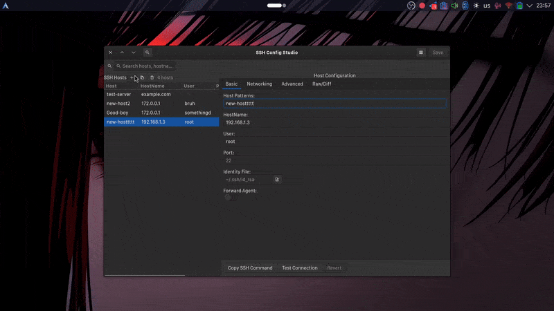

# SSH Config Studio   

A native **GTK4 desktop app** for editing and validating your `~/.ssh/config`.  
Search, edit, and validate SSH hosts with a clean UI — no need to touch terminal editors.

### Preview



### Features

- **Visual host editor**: Edit common fields (Host, HostName, User, Port, IdentityFile, ForwardAgent, etc.).
- **Inline validation**: Field-level errors are shown directly under inputs; parser checks for duplicate aliases and invalid ports.
- **Search and filter**: Quickly find hosts across aliases, hostnames, users, and identities.
- **Raw/Diff view**: Edit raw `ssh_config` text with instant diff highlighting.
- **Quick actions**: Copy SSH command, test connection, and revert changes.
- **Safe saves**: Automatic backups (configurable), atomic writes, and include support.
- **Keyboard- and mouse-friendly**: Smooth GTK 4 UI, dark theme preference.

### Install

SSH Config Studio is currently distributed as source. Linux with GTK 4 is required.

System packages you’ll need (names vary by distro):

- GTK 4 and dependencies
- GObject Introspection runtime
- Python 3.10+
- PyGObject bindings for Python

Examples:

- Debian/Ubuntu: `sudo apt install -y python3-gi gir1.2-gtk-4.0 libgirepository1.0-dev gtk4`  
- Fedora: `sudo dnf install -y python3-gobject gtk4`  
- Arch: `sudo pacman -S python-gobject gtk4`

Then clone and run:

```bash
git clone https://github.com/BuddySirJava/ssh-config-studio.git
cd ssh-config-studio
python3 src/main.py
```

No extra Python packages are required beyond the system-provided PyGObject.

### Usage

1. The app loads `~/.ssh/config` by default. Use the menu → Preferences to choose a different config file or backup directory.
2. Click “+” to add a new host or select a host to edit.
3. Use the Raw/Diff tab for low-level edits; changes are highlighted before saving.
4. Click Save to write changes. A backup can be created automatically (configurable).

### Project structure (high-level)

- `src/ssh_config_parser.py`: Parse/validate/generate SSH config safely.
- `src/ui/`: GTK UI components (`MainWindow`, `HostList`, `HostEditor`, `SearchBar`, `PreferencesDialog`).
- `src/main.py`: Application entry point.

### Support

- Open an issue on GitHub: `https://github.com/BuddySirJava/ssh-config-studio/issues`
- Or reach me on Telegram: `@Buddy_R`

### Contributing

Issues and pull requests are welcome. Please keep code readable and small, focused edits. If you’re touching UI, prefer inline validation over popups and match the existing GTK 4 patterns.

### License

This project is licensed under the [MIT License](https://opensource.org/license/mit).
