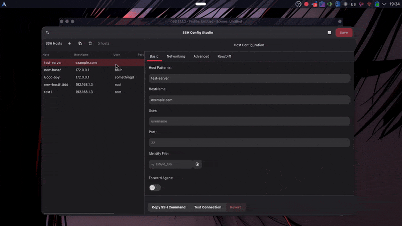

<div align="center">

  

  <h1>
    SSH Config Studio
    
    
    
  </h1>

  <p>A native <strong>GTK4 desktop app</strong> for editing and validating your <code>~/.ssh/config</code>.</p>
  <p>Search, edit, and validate SSH hosts with a clean UI — no need to touch terminal editors.</p>

</div>

### Preview



### Features

- **Visual host editor**: Edit common fields (Host, HostName, User, Port, IdentityFile, ForwardAgent, etc.).
- **Inline validation**: Field-level errors are shown directly under inputs; parser checks for duplicate aliases and invalid ports.
- **Search and filter**: Quickly find hosts across aliases, hostnames, users, and identities.
- **Raw/Diff view**: Edit raw `ssh_config` text with instant diff highlighting.
- **Quick actions**: Copy SSH command, test connection, and revert changes.
- **Safe saves**: Automatic backups (configurable), atomic writes, and include support.
- **Keyboard- and mouse-friendly**: Smooth GTK 4 UI, dark theme preference.

### Install

SSH Config Studio targets Linux with GTK 4 + Libadwaita. System packages you’ll need (names vary by distro):

- GTK 4 and dependencies
- Libadwaita 1 (Adwaita for GTK 4)
- GObject Introspection runtime
- Python 3.10+
- PyGObject bindings for Python

Examples:

- Debian/Ubuntu: `sudo apt install -y python3-gi gir1.2-gtk-4.0 gir1.2-adw-1 libadwaita-1-0 libgirepository1.0-dev gtk4`  
- Fedora: `sudo dnf install -y python3-gobject gtk4 libadwaita`  
- Arch: `sudo pacman -S python-gobject gtk4 libadwaita`

### Build and install (Meson)

```bash
git clone https://github.com/BuddySirJava/ssh-config-studio.git
cd ssh-config-studio

# Install to your user prefix (recommended; no sudo)
meson setup build --prefix="$HOME/.local"
meson compile -C build
meson install -C build

# Launch
python3 -m ssh_config_studio.main
```

After installing, you can also launch it from your desktop app launcher (a desktop entry is installed).

Alternatively, you can run from source without installing:

```bash
git clone https://github.com/BuddySirJava/ssh-config-studio.git
cd ssh-config-studio

# Compile the GResource bundle once (required for UI templates)
glib-compile-resources \
  --sourcedir=data \
  --target=data/ssh-config-studio-resources.gresource \
  data/ssh-config-studio.gresource.xml

python3 src/main.py
```

No extra Python packages are required beyond the system-provided PyGObject.

### Build (Flatpak)

If you prefer Flatpak, a manifest is provided.

```bash
flatpak-builder --user --force-clean --install-deps-from=flathub build-dir com.sshconfigstudio.app.yml --install

# Run
flatpak run com.sshconfigstudio.app
```

### Usage

1. The app loads `~/.ssh/config` by default. Use the menu → Preferences to choose a different config file or backup directory.
2. Click “+” to add a new host or select a host to edit.
3. Use the Raw/Diff tab for low-level edits; changes are highlighted before saving.
4. Click Save to write changes. A backup can be created automatically (configurable).

### Project structure (high-level)

- `src/ssh_config_parser.py`: Parse/validate/generate SSH config safely.
- `src/ui/`: GTK 4 widgets (`MainWindow`, `HostList`, `HostEditor`, `SearchBar`, `PreferencesDialog`).
- `data/ui/*.ui`: GTK Builder UI XML templates consumed via GResource.
- `data/ssh-config-studio.gresource.xml`: GResource manifest.
- `data/media/`: App icon and demo GIF.
- `src/main.py`: Application entry point (source-run). After install, entry point is `python3 -m ssh_config_studio.main`.
- `meson.build`, `data/meson.build`, `src/meson.build`: Build and install rules.
- `com.sshconfigstudio.app.yml`: Flatpak manifest.
- `po/`: Translations.

### Known issues
- Some padding issues
- When editng config using Raw/Diff, custom options added manualy wont appear on Advanced page

### Support

- Open an issue on GitHub: `https://github.com/BuddySirJava/ssh-config-studio/issues`
- Or reach me on Telegram: `@Buddy_R`

### Contributing

Issues and pull requests are welcome. Please keep code readable and small, focused edits. If you’re touching UI, prefer inline validation over popups and match the existing GTK 4 patterns.

### License

This project is licensed under the [MIT License](https://opensource.org/license/mit).
